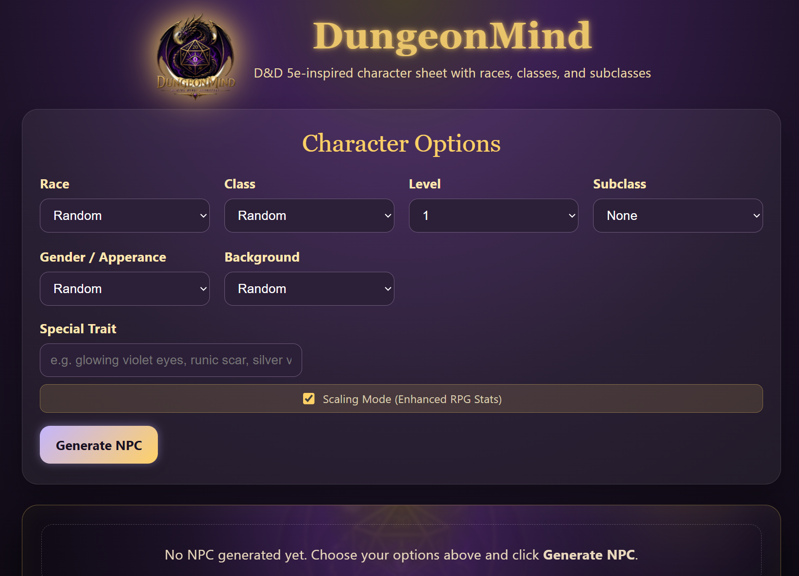

# 🎮 AI-Powered RPG NPC Generator

💡 AI-powered RPG character generator using Azure OpenAI and modern fullstack technologies.

An AI-powered NPC generator for RPG games, built with React, Node.js and Azure OpenAI (Foundry).

---

## 🚀 Features

- AI-generated NPCs (personality, traits, backstory)
- Dynamic character system (class, race, attributes)
- Modular architecture (clean separation of data and logic)
- Ready for integration into games or APIs
- Designed for scalability and future AI features
- Integration of external D&D API for spell data retrieval

---

## 🧠 Tech Stack

- Frontend: React (Vite)
- Backend: Node.js / Express
- AI: Azure OpenAI (Foundry)
- Version Control: GitHub
- UI: Custom components (StatBox, FeatureCard, etc.)
- External API: Dungeons & Dragons API (for spell data)

---

## 🎯 Use Case

This tool is designed for:

- Game developers (NPC generation)
- RPG tools and systems
- AI-driven storytelling
- Procedural content generation

---

## ⚙️ How it works

1. User selects character parameters (class, race, etc.)
2. Application retrieves spell data from an external D&D API
3. Backend processes structured input
4. Azure OpenAI generates character content (traits, backstory, personality)
5. Frontend renders a complete NPC sheet

---

## 🔗 Data Sources

- Dungeons & Dragons API (for spell data)
- AI-generated content (Azure OpenAI)

---

## 🔮 Future Improvements

- AI dialogue system (interactive NPC chat)
- Memory system (NPC remembers player actions)
- Export API (JSON for game engines)
- AI-generated quests and storylines

---

## 💡 Why this project matters

This project shows real-world application of:

- Generative AI in interactive systems
- LLM integration into production apps
- AI-assisted content creation workflows

---

## 🧑‍💻 Author

Jessica Ratnam  
AI Developer (Azure OpenAI, React, Node.js)
